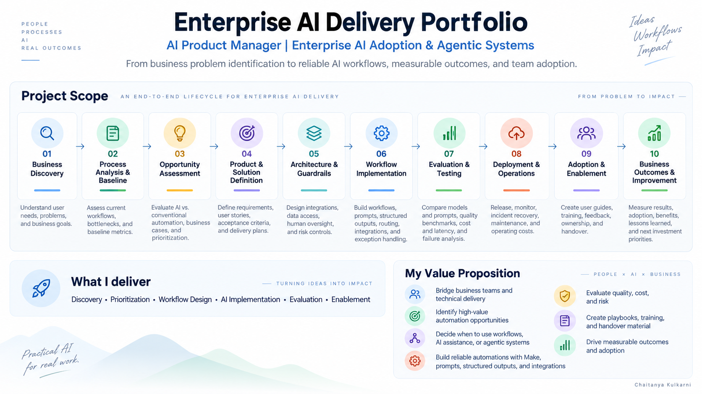

# Chaitanya Kulkarni

**AI Product Manager | Enterprise AI Adoption & Agentic Systems**

I am an AI Product Manager with a background in AI automation, enterprise enablement, and LLM evaluation across India and the United States. With a **Master’s in Management of Technology from New York University** and **Specialization in Agentic AI from Johns Hopkins University** , I combine business discovery, technology assessment, and product thinking with hands-on workflow implementation and evaluation.

My work connects business teams and technical delivery: understanding how people work, identifying worthwhile automation opportunities, defining requirements, designing solutions, evaluating model performance, and supporting rollout and adoption. I take a practical approach to choosing between conventional automation, AI assistance, and agentic workflows—balancing business value with quality, cost, risk, and maintainability.

**I like to own end-to-end ownership: from identifying business problem to building reliable workflows with measurable outcomes, and the playbooks a team needs to use and maintain the solution.**

## Enterprise AI Delivery Portfolio

This portfolio contains my delivery frameworks and a practical example based on my experience of implementation at an organization, organized around the full implementation lifecycle. It combines my approach and frameworks derived from over 2 years of experience working at New York University IT division, and a regulatory compliance startup in New York. You can click the link on each stage starting from business discovery to business outcomes and improvement to view the pdf demonstrating approach, and view reusable frameworks. 

| Portfolio section | Focus | PDF |
|---|---|---|
| **00 · Project Context & Mandate** | Overview of real world situations prevalent in organizations implementing AI based on my experience. Sets context for all sections below | [View PDF](<./pdfs/00 -  Project Context & Mandate.pdf>) |
| **01 · Business Discovery** | Stakeholder interviews, user needs, problem definition, impact assessment & prioritization and business alignment. | [View PDF](<./pdfs/01_Business_Discovery(1).pdf>) |
| **02 · Process Analysis & Baseline** | Current workflows, handoffs, bottlenecks, workload, and baseline measurement. | [View PDF](<./pdfs/02_Process_Analysis_Baseline_Clean_Final.pdf>) |
| **03 · Opportunity Assessment** | AI versus conventional automation, business cases, costs, feasibility, data readiness, and prioritization. | [View PDF](<./pdfs/03_Opportunity_Assessment_Visual.pdf>) |
| **04 · Product & Solution Definition** | Product requirements, future-state workflows, user stories, acceptance criteria, and delivery plans. | [View PDF](<./pdfs/04_Product_and_Solution_Definition_Revised.pdf>) |
| **05 · Architecture & Guardrails** | Technology trade-offs, integrations, data access, human oversight, and risk controls. | [View PDF](<./05_Architecture_Guardrails.pdf>) |
| **06 · Workflow Implementation** | Make workflows, prompts, structured outputs, routing, integrations, and exception handling. | In preparation |
| **07 · Evaluation & Testing** | Model and prompt comparisons, quality benchmarks, cost and latency, regression tests, and failure analysis. | [View PDF](<./pdfs/07_Evaluation_Testing.pdf>)  |
| **08 · Deployment & Operations** | Version control, release decisions, monitoring, incident recovery, maintenance, and operating costs. |[View PDF](<./pdfs/08_Deployment_and_Operations.pdf>) |
| **09 · Adoption & Enablement** | User guides, reviewer playbooks, training, feedback, ownership, and handover. | [View PDF](<./pdfs/09_Adoption_Enablement_Playbook.pdf>)  |
| **10 · Business Outcomes & Improvement** | Measured results, adoption, benefits, lessons learned, and the next investment priorities. | [View PDF](<./pdfs/10_Business_Outcomes_and_Improvement.pdf>) |

